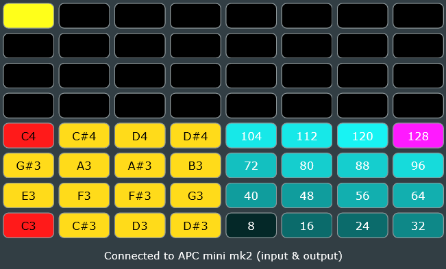

# APCX

APCX is a **VST3 MIDI effect** for the **Akai APC Mini MK2** that turns the controller into a **live step sequencer**: build patterns on the pad grid, run the sequence in time with your DAW, and drive software instruments with the plug-in’s MIDI output.



---

## Download and install

APCX is **Windows-only** for now (Windows 10 or later).

### What you need

- **Akai APC Mini MK2** connected over USB  
- Windows 10 or later  
- A VST3-capable DAW that can host a **MIDI effect** and route its MIDI onward  

### Get the latest build

Open the repository **[Releases](https://github.com/distantdev/apcx/releases)** page on GitHub and download the latest **MSI** or **ZIP** for Windows.

### Option A — MSI installer (recommended)

1. Download **`APCX-Setup.msi`** from the release.  
2. Run the installer and complete the steps.  
3. Restart your DAW or run its **plug-in rescan** so it picks up APCX.  

The installer places the VST3 bundle where your system expects VST3 plug-ins (you should not need to copy files by hand).

### Option B — ZIP (manual install)

1. Download **`APCX-VST3-Windows.zip`** from the release and extract it.  
2. Copy the **`APCX.vst3`** bundle (the whole folder-like bundle, not a single `.dll` inside it) into a VST3 folder your DAW scans, for example:  
   - **All users:** `C:\Program Files\Common Files\VST3`  
   - **Your account:** `%APPDATA%\VST3`  
   Your DAW may use an extra custom folder—check its plug-in preferences.  
3. Rescan plug-ins in your DAW and load **APCX**.

If the DAW does not list APCX, confirm the **full** `APCX.vst3` bundle was copied and that you chose a folder that appears in the DAW’s VST3 scan list.

---

## Using APCX

1. Connect the **APC Mini MK2** over USB before or right after you open the plug-in.  
2. Insert APCX on a track or slot where your DAW allows **MIDI-generating / MIDI-effect** VST3s, and route its MIDI output to a software instrument (or the next MIDI effect in the chain), following your DAW’s usual rules for MIDI FX.  
3. Watch the status line at the bottom: it should move from **searching** to **connected** when the APC is found.  
4. **Top four pad rows (32 pads):** step positions in the live sequencer—tap pads to enable or edit steps.  
5. **Bottom left 4×4:** note / pitch selection for painting steps.  
6. **Bottom right 4×4:** velocity selection.  

**Key / scale / octave** controls are under the grid. **Pad colors on the APC** show the current step, active notes, and velocity.

**Shift on the hardware:** hold **Shift** on the APC for the on-device scale/key/octave overlay.

---

## Development — environment and build

These steps match **CMake + Visual Studio 2022**, which is what this repo and **GitHub Actions** use. Building on macOS/Linux is not set up in this repository yet.

### Prerequisites

| Tool | Notes |
|------|--------|
| **Git** | For clone and submodules. |
| **CMake** | **3.22** or newer (`cmake --version`). |
| **Visual Studio 2022** | Workload **Desktop development with C++**, including the **MSVC** and **Windows** SDK toolsets. |

### Clone the repository

JUCE is included as a **git submodule**, so clone with submodules:

```bash
git clone --recurse-submodules https://github.com/distantdev/apcx.git
cd apcx
```

If you already cloned without submodules:

```bash
cd apcx
git submodule update --init --recursive
```

### Pinned JUCE version

APCX targets **JUCE 8.0.12** (tag **`8.0.12`** on [juce-framework/JUCE](https://github.com/juce-framework/JUCE)). Keep the submodule on that tag unless you bump it and re-check CI and local builds.

To move the submodule to that tag after cloning:

```bash
cd JUCE
git fetch --tags
git checkout 8.0.12
cd ..
git add JUCE
git commit -m "Pin JUCE submodule to 8.0.12"
```

### Build (CMake, same as CI)

From the repository root in **PowerShell** or **cmd**:

```powershell
cmake -B build -G "Visual Studio 17 2022" -A x64
cmake --build build --config Release --target APCX_VST3
```

**Output:**

- Release VST3 bundle: `build\APCX_artefacts\Release\VST3\APCX.vst3`  
- With the current CMake settings, a copy may also be written under `build\VST3\` after a successful build (useful for quick testing).

To install manually for testing, copy the **`APCX.vst3`** bundle into a VST3 scan folder (see [Option B — ZIP](#option-b--zip-manual-install) above) and rescan in your DAW.

### After `git pull`

If submodule pointers change:

```bash
git pull
git submodule update --init --recursive
```

### CI and releases (maintainers)

The workflow **`.github/workflows/build.yml`** runs on:

- **Pull requests** targeting `main`  
- **Pushes** of tags matching `v*` (e.g. `v1.0.0`)  
- **Manual** runs (**Actions** → workflow → **Run workflow**)

It produces **build artifacts**: a **VST3 ZIP** and an **MSI**. For `v*` tags it also creates a **GitHub Release** and attaches those files.

---

## Contributing

Pull requests are welcome. Use the **CMake** build, test with an **APC Mini MK2** when you can, and note behavior changes—especially MIDI timing or hardware mapping.

---

## License

Copyright © 2023-2026 Distant Nebula. All rights reserved.

Contact: Levi Sluder — [levi@distantnebula.com](mailto:levi@distantnebula.com) — [https://distantnebula.com](https://distantnebula.com)
